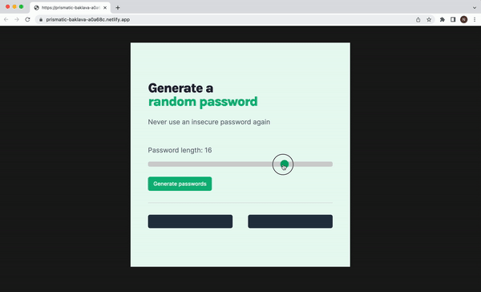

# Password generator

Password generator creates two random passwords.

## Features
Users set the desired length of the password and then click the button that creates two random passwords using uppercase and lowercase letters, numbers and special characters.

## Demo

Test it on Netlify: https://password-generator-natalia-davtyan.netlify.app/

## Technologies
The project is built using:
* HTML
* CSS
* JavaScript

## Project status
The project is complete.

## Room for improvement
* Add an option to copy password to clipboard on click

## Acknowledgements
Password generator is a solo project that was part of [the Frontend Developer Career Path at Scrimba](https://scrimba.com/learn/frontend).

## Contact
Created by [Natalia Davtyan](https://github.com/nataliadavtyan)
